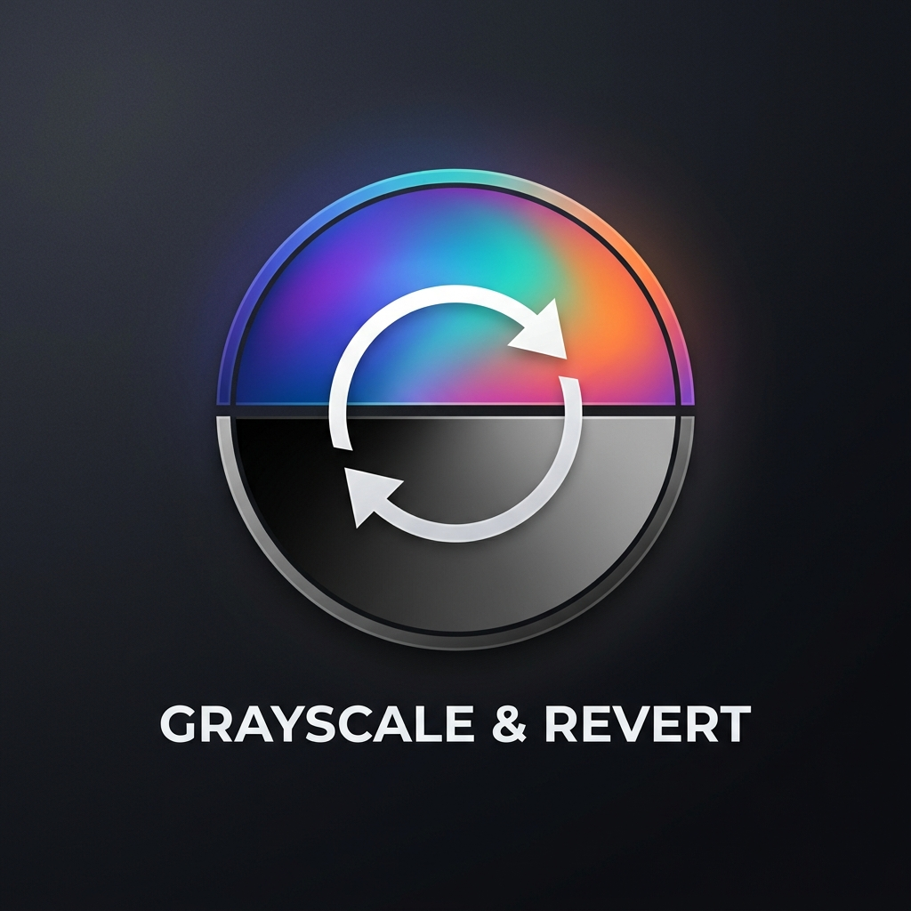

# 🎨 Grayscale & Revert - Figma Plugin

<div align="center">
  
  
  <br />

  [](https://www.figma.com/)
  [](LICENSE)
  [](https://developer.mozilla.org/en-US/docs/Web/JavaScript)
</div>

---

## 📌 Overview

**Grayscale & Revert** is a powerful and smooth Figma plugin designed for UI/UX designers, accessibility testing, visual case studies, and fast color workflow operations. It instantly converts design elements, images, layers, and gradients into accurate grayscale based on human visual luminance perception (BT.709 sRGB Luminance).

Furthermore, it features a 100% **lossless Revert** function that restores original colors at any time by securely storing color states directly inside each node's `pluginData` in Figma.

---

## ✨ Features

- 🌗 **Accurate Grayscale Conversion (BT.709 Standard):** Computes true human-perceived luminance using the standard sRGB formula:
  $$Y = 0.2126 \times R + 0.7152 \times G + 0.0722 \times B$$
- 🔄 **100% Lossless Color Revert:** Safely backs up original color properties into node `pluginData`. Restore original colors anytime with a single click.
- 🖼 **Comprehensive Element Support:**
  - Solid Fills & Text Fills (including multi-colored range text / mixed fills).
  - All Gradient types (Linear, Radial, Angular, Diamond).
  - Strokes & Shadow Effects (Inner Shadow & Drop Shadow).
  - Image fills with automated saturation filter adjustments.
- ⚡ **Quick Context Menu Actions:** Run direct commands right from the Figma canvas without keeping the UI panel open.
- 💎 **Modern Glassmorphism UI:** Clean control panel interface that automatically adapts to Figma's Light and Dark modes.

---

## 📁 Project Structure

```text
Grayscale plugin figma/
├── manifest.json                  # Figma Plugin configuration (Manifest v2)
├── code.js                        # Figma Plugin backend sandbox logic
├── ui.html                        # User interface (HTML/CSS/JS)
├── case_study_process_chart.html  # Process chart & case study interactive layout
├── avatar.png                     # Plugin avatar / logo (AI Generated)
├── icon.png                       # 128x128 icon for Figma Plugin
└── README.md                      # Documentation & usage guide
```

---

## 🚀 Installation

1. **Clone the repository:**
   ```bash
   git clone https://github.com/quendinao/grayscale-plugin-figma.git
   ```

2. **Open Figma Desktop App:**
   - Go to menu: `Plugins` -> `Development` -> `Import plugin from manifest...`
   - Select the `manifest.json` file inside the cloned repository directory.

3. **Run the Plugin:**
   - Right-click anywhere on the canvas or select layers in Figma -> `Plugins` -> `Development` -> `Grayscale & Revert`.

---

## 🛠 Usage & Commands

| Command | Description |
| :--- | :--- |
| **Open Plugin Panel** | Opens the full UI panel with statistics, action triggers, and options. |
| **Convert Selection to Grayscale** | Instantly converts all selected layers to grayscale without opening the UI. |
| **Revert Selection Colors** | Restores selected layers back to their original color palette. |

---

## 🧠 Technical Architecture

1. **State Preservation:**
   During conversion, original color properties are serialized into JSON and attached to the node via `node.setPluginData("original-colors", JSON.stringify(data))`. Reversion reads this metadata to restore exact paints, gradients, strokes, and drop shadows.

2. **Mixed Text Range Fills:**
   Special handling for text nodes with variable character styling ensures no font properties or range fill attributes are lost during grayscale conversion or restoration.

---

## 📜 License

This project is licensed under the [MIT License](LICENSE).
